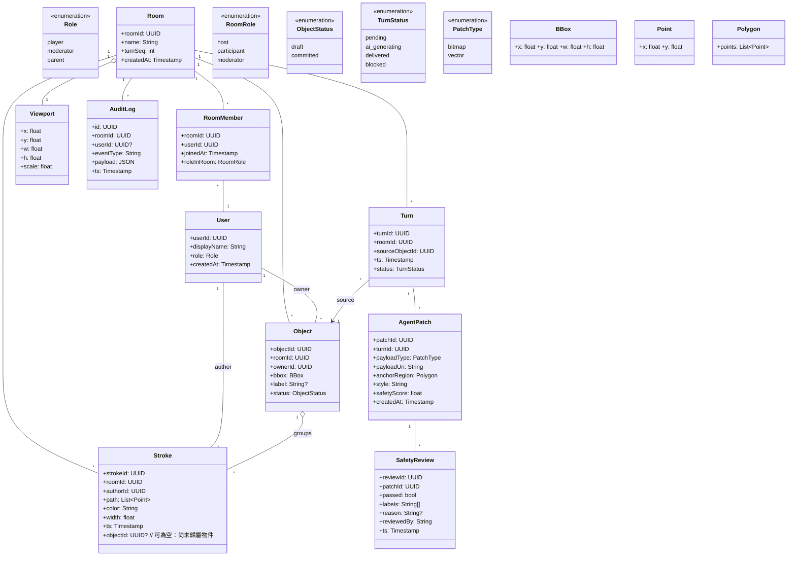
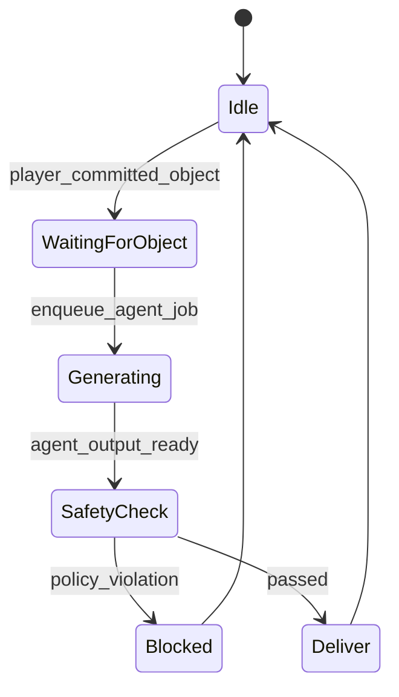
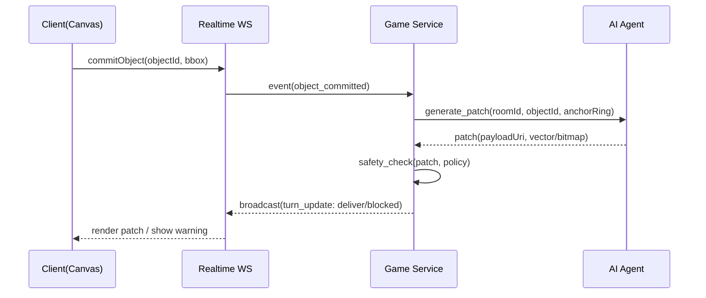

# AGENTS.md

## 🏷️ 專案名稱
InfiniteKidsCanvas — 兒童向「AI 畫畫接龍」原型

## 🎯 產品目標
在平板或手機上，使用者在「無邊際畫布」上畫圖；AI 以童話風格、且嚴格兒童安全的規範下，沿著使用者剛畫的物件「周邊」接續作畫，所有接龍都能在同一視窗內被看見。

---

## 🧭 系統概觀（高層架構）
- **Client（Web / 行動瀏覽器為主）**：HTML5 Canvas 繪圖、手勢（平移/縮放）、WebSocket 即時同步。
- **Realtime Gateway**：WebSocket 房間/主題；廣播筆劃（strokes）、物件（objects）、AI 回合（turns）。
- **Game Service（Python/FastAPI）**：房間/會話管理、資料儲存（PostgreSQL + Redis）、安全審核管線。
- **AI Agent**：接收「玩家物件的邊界框 + 位置」→ 產生童話風格延伸圖塊（patch）→ 送回座標與影像/向量指令。
- **Content Safety/Moderation**：字詞/提示過濾、圖像安全檢測、家長/管理員覆審工作流。

---

## ✅ 可執行原型範圍（Prototype Scope）
- 單一房間 / 多使用者同步畫布
- 筆劃資料結構、基本撤銷/重做（local-first，伺服器最終一致）
- 使用者完成一個「物件」後，AI 只在該物件「周圍環帶（anchor ring）」內創作
- 童話風格規則 + 不當內容封鎖（先以規則/關鍵字 + 圖像安全模型雙層）
- UI 以原型為主（樣式可日後再優化）

---

## 📌 功能需求（FR）
1. 使用者可在無邊際畫布（可平移/縮放）繪圖，筆劃同步。
2. 使用者將多筆劃合併成「物件」（Object），傳回伺服器計算邊界框（BBox）。
3. AI 接龍：只在該物件周邊「Anchor Ring」區域生成延伸內容並回傳，保持同屏可見。
4. 遊戲回合（Turn）：使用者 → AI → 使用者 → …；每回合產生可回溯事件（Event Log）。
5. 嚴格兒童安全：禁止暴力、成人、仇恨、血腥、危險行為等；違規時阻擋或替換為安全建議。

## 🚫 非功能需求（NFR）
- 手機與平板在一般 4G/5G/ Wi-Fi 下，**端到端延遲 ≤ 300ms（筆劃同步）**
- AI 生成回應（接龍 patch）**目標 2–6 秒內**回傳（可先以簡化佔位圖/向量抽象過渡）
- 伺服器可水平擴充；筆劃資料支援壓縮儲存（delta + gzip）
- 完整稽核：所有 AI 輸出均有安全檢測與日誌（可追溯）

---

## 👥 用例（Use Cases，文字）
- UC-01 畫圖：玩家在畫布上繪圖並同步其他玩家
- UC-02 建物件：玩家將一組筆劃合併為「物件」
- UC-03 AI 接龍：AI 在該物件周邊生成童話風格延伸
- UC-04 安全審核：系統對提示與影像雙層過濾，違規則拒絕或替換
- UC-05 回朔：玩家可回放前幾回合狀態（timeline scrubber）

---

## 📦 類別圖（Class Diagram, Mermaid）

## 🔄 狀態圖（State Diagram：AI 接龍工作流）

## 🔁 互動序列（Sequence：一次接龍回合）

## 🧑‍💻 開發規範（給 Code Agent 的硬性規定）
•	語言/框架：Backend 用 Python 3.11 + FastAPI；WS 用 websockets 或 fastapi[websockets]；前端先用原生 TS + Canvas（後續可換 React/Flutter）。
•	資料庫：PostgreSQL（永續）＋ Redis（即時暫存與事件快取）。
•	端點/通道：
•	POST /api/rooms/{roomId}/objects 建物件（含 bbox）
•	WS /ws/rooms/{roomId} 廣播筆劃 / 事件（topic: stroke, object, turn）
•	POST /api/turns/{turnId}/retry 僅管理者或家長可觸發
•	程式風格：Python 遵循 PEP8，強制 black + ruff；前端 eslint + prettier。
•	測試：pytest -q 覆蓋率 ≥ 80%；WS 行為以 pytest-asyncio。
•	提交/PR：
•	Commit：[module] action: summary
•	PR 必附：測試結果、風險說明（效能/安全/相依）

## 🛡️ 兒童安全與風格規範（必遵守）
•	風格：童話故事風、明亮色調、友善角色；避免寫實暴力/血腥。
•	禁用清單：暴力、成人、酒藥槍、仇恨、恐怖驚嚇、危險行為、個資。
•	安全流程：
	1.	文本提示過濾 → 2) 影像安全偵測（分類/NSFW/暴力）→ 3) 失敗則遮罩＋回覆安全建議。
•	記錄：所有 AI 產出與安全判定需留審計日誌。

## 🧮 幾何與擺放（Anchor Ring 規則）
•	從 Object.bbox 擴張為外環（padding = max(物件寬高)*0.4），形成環帶。
•	AI Patch 只能落在此環帶；若與其他元素重疊 > 30% 則重新取樣位置。
•	若畫面視窗無法容納，優先往視窗內縮放/平移，確保接龍「同屏可見」。

## 🗂️ 專案目錄（建議）
/backend
  /app
    api/    # FastAPI routers
    ws/     # WS handlers
    core/   # config, security, logging
    models/ # pydantic + orm models
    services/ # turn, patch, safety
    tests/
  pyproject.toml
/frontend
  /src
    canvas/
    ws/
    ui/
  package.json
/docs
  AGENTS.md  # 本文件
  api.md

## 接龍擺放（關鍵演算法）
輸入：物件 bbox、目前畫面視窗（viewport）、既有元素 R-tree 索引
•	步驟：
	1.	以 bbox 中心為圓心，設定半徑 r = max(w,h)*k（k≈0.7~1.2），掃描角度 θ 找最近不重疊位置
	2.	位置通過「同屏可見」檢查（與 viewport 交集 ≥ 70%）
	3.	產出 anchorRegion（小多邊形或遮罩），交給 AI

## 內容安全（先規則、後模型）
•	文本提示：關鍵字黑名單 + 模糊比對（例如 “刀/血/菸/酒/嚇/爆…”）
•	圖像：採一個現成的安全分類器（NSFW/暴力），低風險起步；存疑則遮罩＋替代

